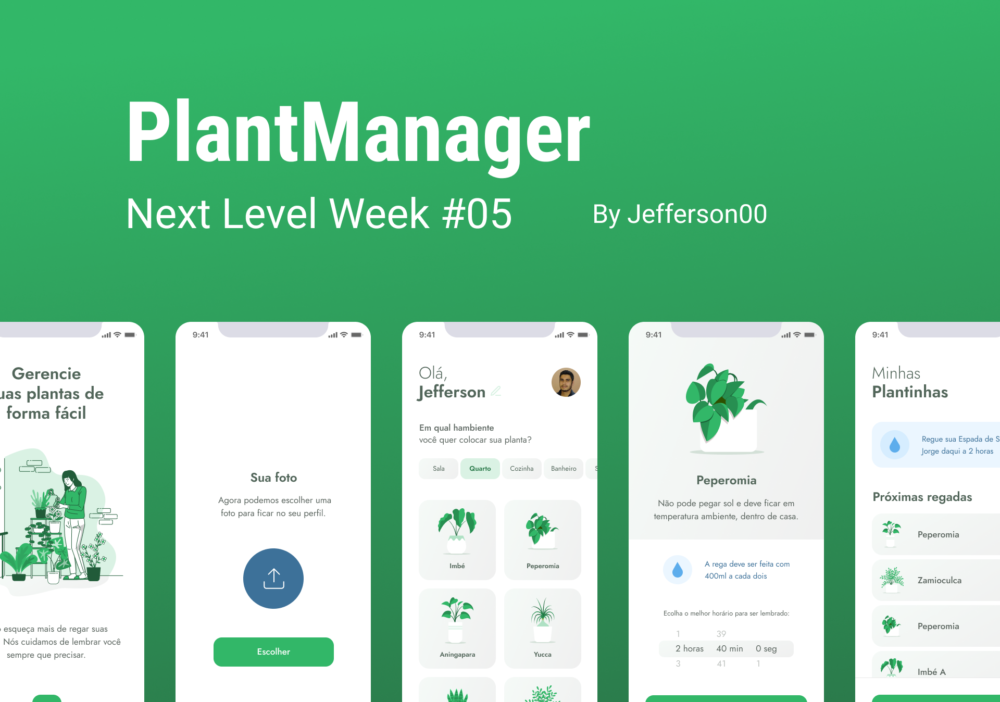

<h1 align="center">
    
</h1>


<p align="center">
  
  
      

  <a href="https://www.linkedin.com/in/jefferson-c-silva-aa1b7b1a9/">
    
  </a>
</p>

<br>

<p align="center">
  
</p>

---

## 🧪 Technologies

This project was developed using the following technologies:

- [React Native](https://reactnative.dev/)
- [Expo](https://expo.io/)
- [TypeScript](https://www.typescriptlang.org/)
- [StyledComponents](https://www.styled-components.com/)

## 💻 Features

- List plants from a API (fake API)
- Store plants to remember to water them (with push notifications)
- Store and edit user name and photo
- Delete or Update a scheduled plant

## 🚀 Getting started

Clone the project and access the folder

```bash
$ git clone https://github.com/Jefferson00/PlantManager.git && cd plantmanager
```

Follow the steps below
```bash
# Install the dependencies
$ yarn install

# Start the project
$ expo start
```

## 💻 Project

App to always remember to water your plants 🌱

This is a project developed during the **[Next Level Week](https://nextlevelweek.com/)**, presented by **[@Rocketseat](https://github.com/Rocketseat)** during April 19-25, 2021.

## 🔖 Layout

You can view the project layout through the links below:

- [Layout](https://www.figma.com/file/IhQRtrOZdu3TrvkPYREzOy/PlantManager) 

Remembering that you need to have a [Figma](http://figma.com/) account to access it.

## 📝 License

This project is licensed under the MIT License. See the [LICENSE](LICENSE.md) file for details.


---

Made with ♥ by Jefferson C Silva :wave: [Get in touch!](https://www.linkedin.com/in/jefferson-c-silva)

